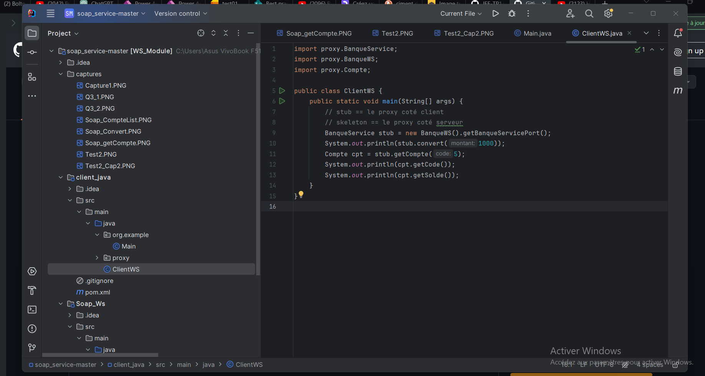
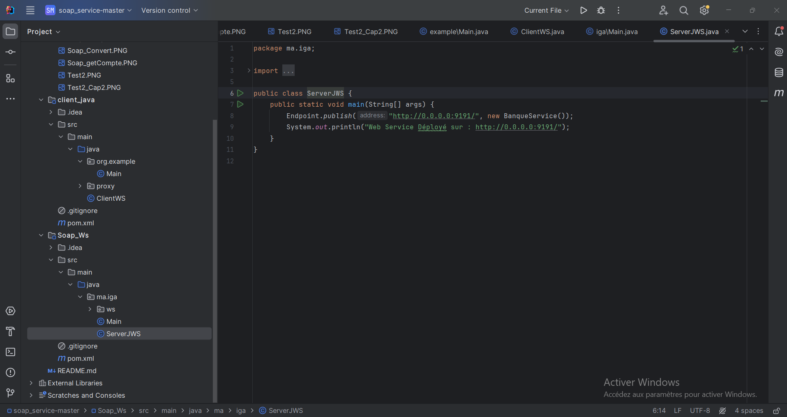
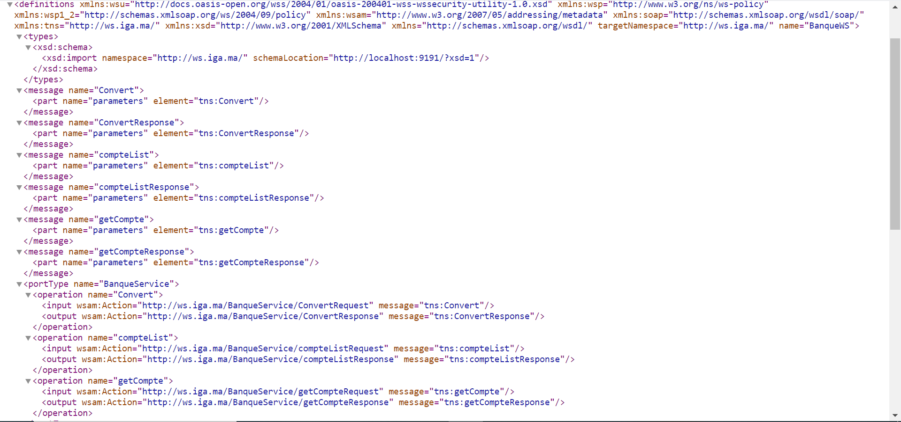
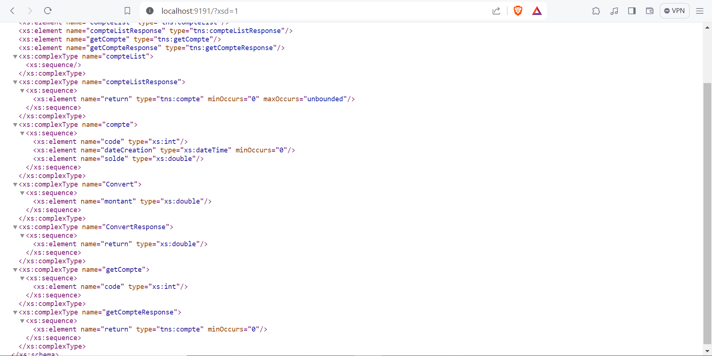
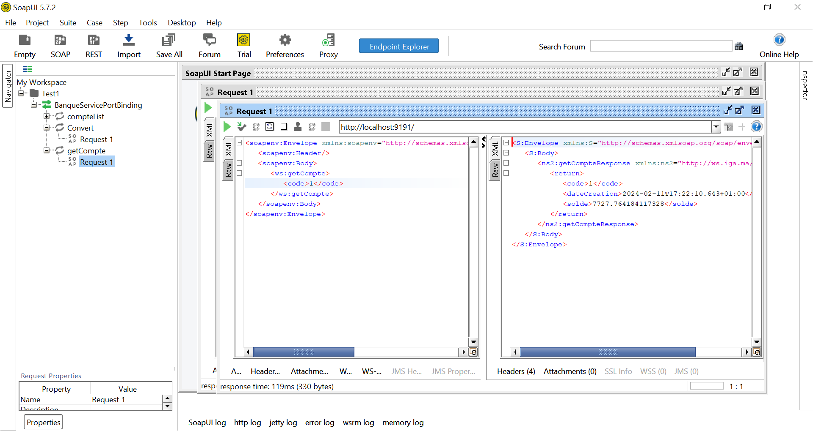
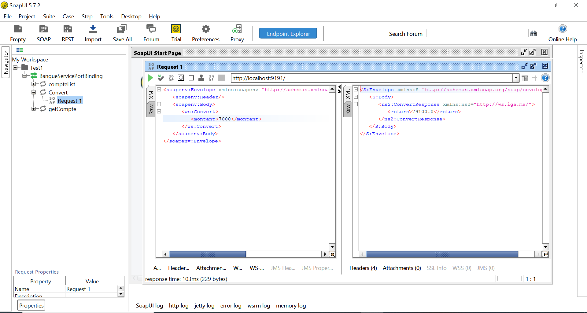
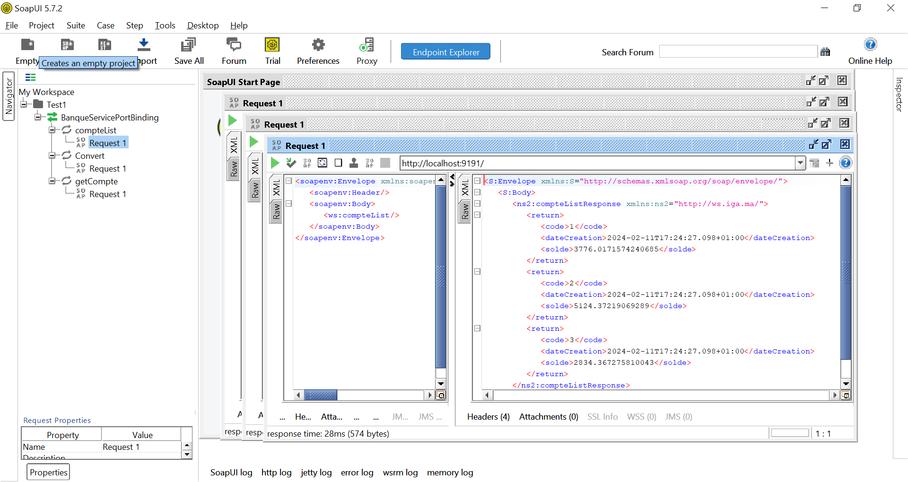
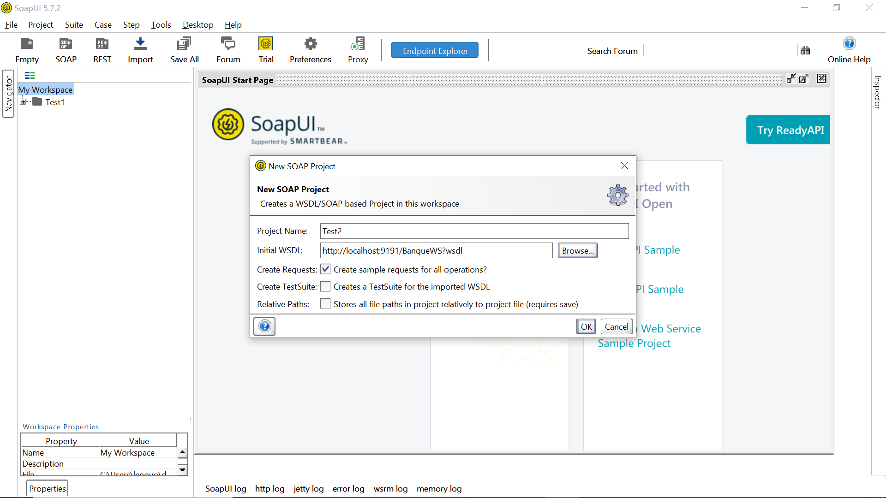
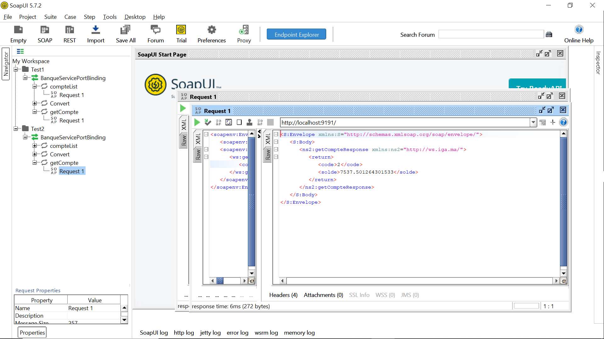

<h3>TP 1 </h3>

<ul>
    <li>1. Création du Web service </li>
</ul>
Operation : 
    Convertir un montant de l’auro en DH
    Consulter un Compte
    Consulter une Liste de comptes

<ul>
    <li> 2. Déploiement du Web service </li>
</ul>

<ul> 
    <li> 3. Consulter le WSDL avec le navigateur</li>
</ul>

<ul>
    <li>
        4. Tester le web service SoapUI
         
    </li>
</ul>

<ul>
    <li> 5. Création du client SOAP </li>
</ul>

